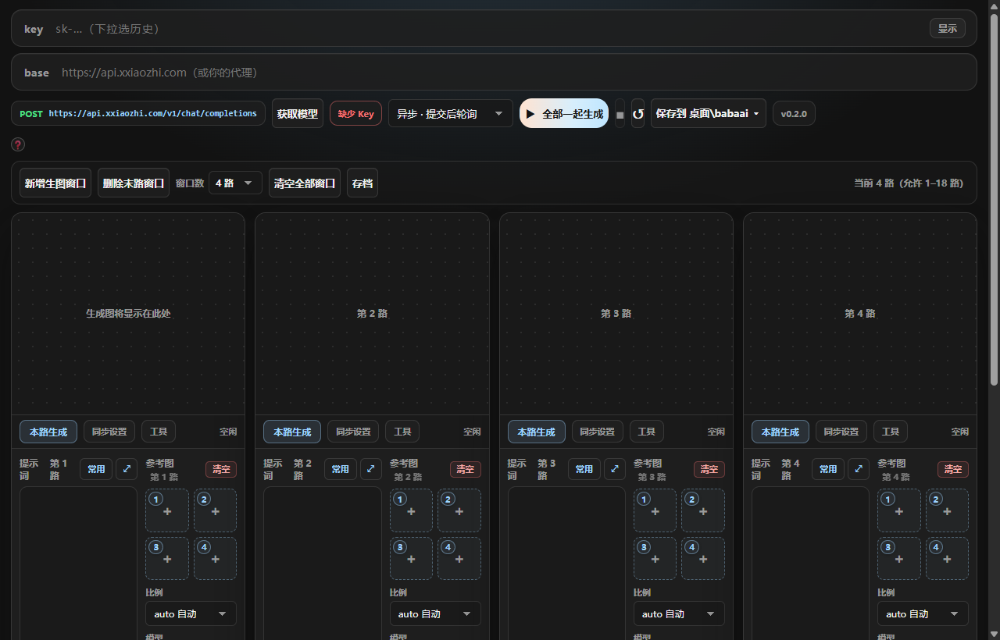
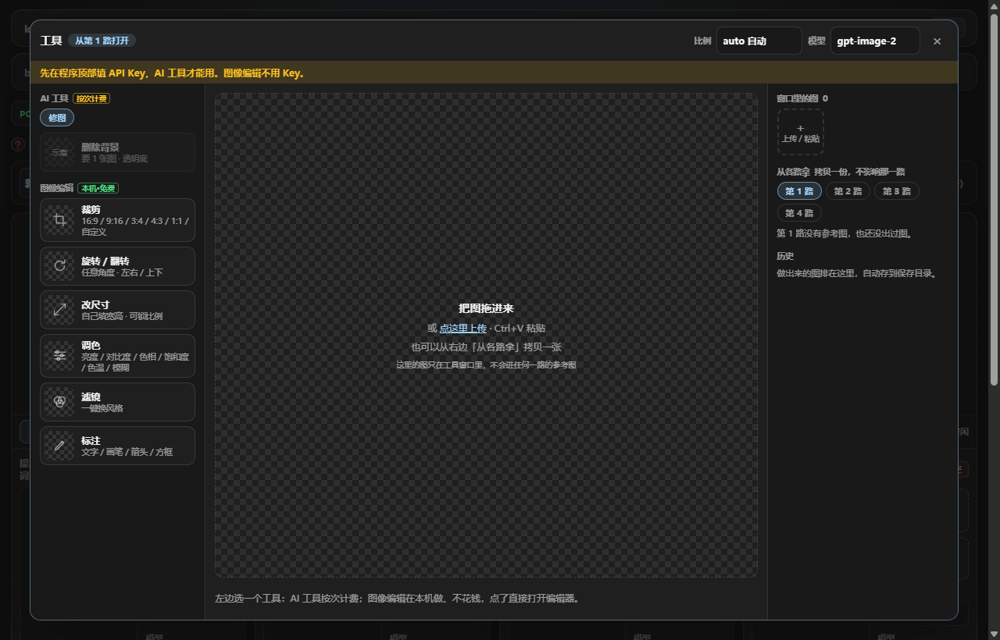

<h1 align="center">Generater</h1>

<b>生图小霸王</b> · Windows 桌面程序，下载双击就用。多路同时出图、参考图、AI 预设工具、图像编辑，全在一个窗口里。

  <a href="https://github.com/boombbo/generater/releases/latest/download/imagegen-desktop_windows_amd64.exe"><b>下载最新版（Windows 10 / 11）</b></a>
  &nbsp;·&nbsp;
  <a href="https://boombbo.github.io/generater/"><b>使用说明</b></a>
  &nbsp;·&nbsp;
  <a href="https://github.com/boombbo/generater/issues/new/choose">反馈问题 / 提建议</a>
  &nbsp;·&nbsp;
  <a href="https://github.com/boombbo/generater/releases">全部版本</a>

## 三步开始

| 1 · 下载 | 2 · 填 Key | 3 · 出图 |
|---|---|---|
| 下载 `imagegen-desktop_windows_amd64.exe`，放到任意文件夹，双击 | 顶栏填 **API Key**（兼容 OpenAI 接口的 Key；接口地址默认 `api.xxiaozhi.com`，也可以换成你自己的代理），点 **获取模型** | 写提示词，点 **全部一起生成**。图自动存到 **桌面\babaai\图片** |

> Windows 弹「已保护你的电脑」→ 点「更多信息」→「仍要运行」。程序没有买签名，第一次运行会这样。

## 能做什么

| | |
|---|---|
| **多路出图** | 1–18 路同时跑，每路各自的提示词 / 参考图 / 比例 / 模型；「同步设置」一键刷给其他路 |
| **参考图** | 每路最多 4 张，上传、粘贴、拖进来都行 |
| **工具窗口** | 每路的「工具」按钮打开：AI 预设（去背景等，按预设的要求放图）+ 图像编辑（裁剪 16:9 / 9:16 / 3:4 / 4:3 / 1:1、任意角度旋转、改尺寸、调色、滤镜、标注 —— 本机做、不花钱）。结果一键放进某一路的参考图 |
| **存档** | 整套现场（提示词 / 参考图 / 比例 / 模型 / 路数）存一份，随时切回来 |
| **自动保存** | 出的图按「提示词前 16 字_时间」存到 桌面\babaai，顶栏「保存到」可以改位置 |
| **自动更新** | 打开程序自己查新版，顶栏右上角版本号亮了点「立即更新」；不点就不更新 |

完整说明（每个按钮是干什么的、文件存在哪、常见问题）看 **[使用说明](https://boombbo.github.io/generater/)**，每一版的下载页里也带一份 `README.html`。

## 反馈

- **最省事**：程序里出错的地方旁边有「反馈这个问题」，版本号浮层里有「反馈问题 / 提建议」。版本、系统、报错和最近的日志会自动填好，浏览器打开这里后点一下「Submit new issue」就行（要有 GitHub 账号）。
- 也可以直接点上面的 **Issues → New issue**，选「出问题了」或「想要新功能」。截图直接粘贴到描述框里。
- 反馈是公开的：日志里没有 API Key，但会有你用的代理地址和报错原文；提交前可以在程序里取消附带日志。

修好后会在你那条 issue 下回复是哪一版修好的并关闭；程序会自动更新，版本号那里也会提示「你反馈的 #编号 已修复」。

## 文件

| 文件 | 是什么 |
|---|---|
| `imagegen-desktop_windows_amd64.exe` | **程序本体，下载这个** |
| `README.html` | 使用说明，和上面的链接是同一份 |
| `checksums.txt` | 校验值，程序自动更新时用来核对下载的文件 |

这里只放安装包、说明和反馈，没有源码。
